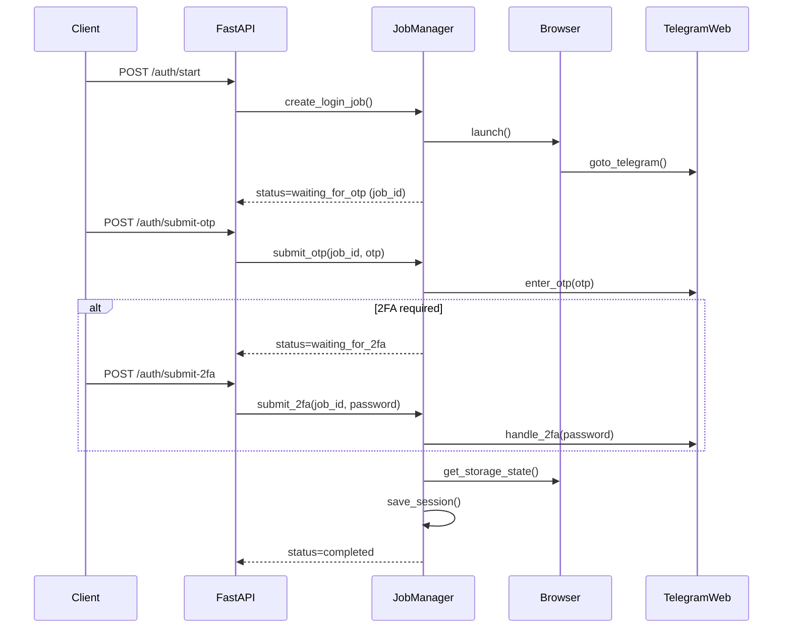

# Architecture

## Overview
Hệ thống được tách thành 2 lớp:
- `src/telegram_bot/`: domain/library (Playwright automation, session, reports, notes).
- `src/api/`: FastAPI server bọc các use-case thành REST API.

## Login job flow (OTP/2FA via API)

## Stateless endpoints (contacts/groups)
Các endpoint như `/contacts/*`, `/groups/*` chạy theo kiểu “stateless”:
- Load session file trong `sessions/`
- Mở browser -> load context -> thực thi -> đóng browser

Điểm này giúp API dễ vận hành hơn (mỗi request độc lập) nhưng sẽ tốn chi phí mở browser.

